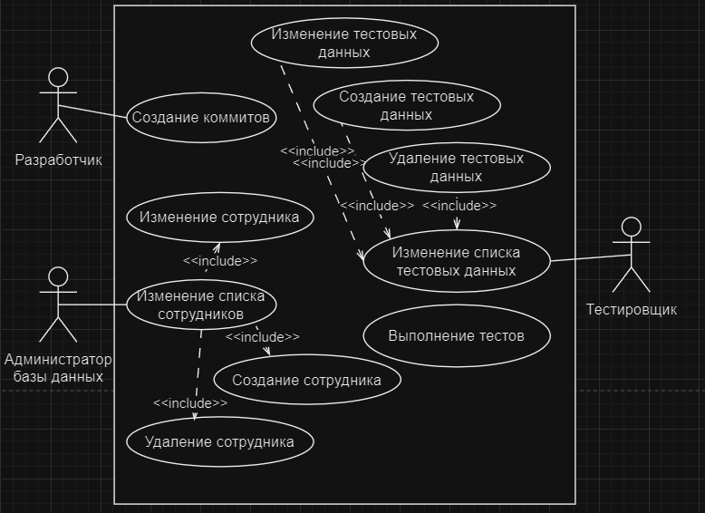
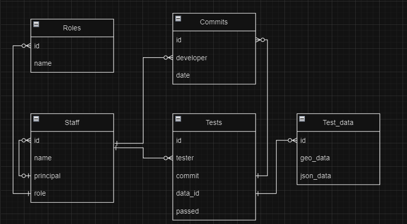
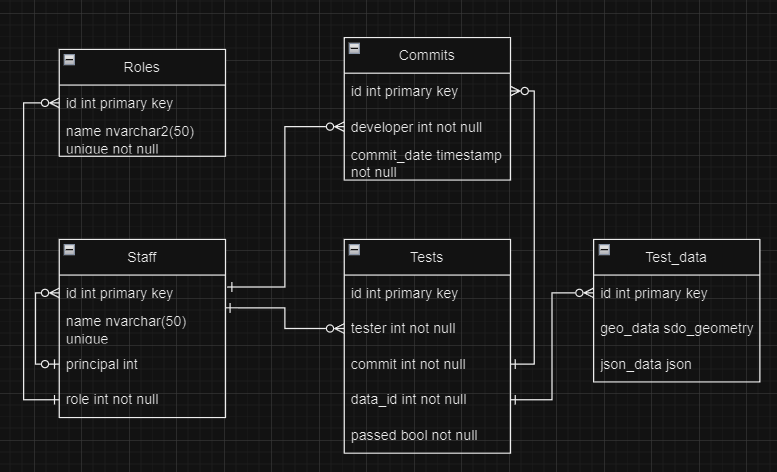

2.	Описать целевую аудиторию и стратегии использования интернет-приложения.
    - аудитория
        - команды разработки, в которых существует сегрегация между разработчиками и тестировщиками
    - стратегии
        - Администратор базы данных изменяет информацию о сотрудниках (STAFF)
        - Разработчики добавляют информацию о коммитах (COMMITS)
        - Тестировщики создают тестовые данные (TEST_DATA) для использования в тестировании
        - Тестировщики выполняют тесты, добавляя записи в таблицу TESTS, указывая тестировщика, коммит, набор тестовых данных и результат теста
        - Можно использовать базу данных для отслеживания связей между сотрудниками, коммитами, тестировщиками и результатами тестов (кто из разработчиков чаще косячит)
3.	Разработать UML диаграммы для каждой роли приложения.
    - 
4.	Выделить основные сущности, описывающие предметную область. 
    - сотрудники (и их роли)
    - коммиты
    - тесты (и их данные)
5.	Определить и уточнить атрибуты для каждой сущности.
6.	Определить связи между сущностями.
7.	Преобразовать сущности в таблицы базы данных согласно выбранной модели.
8.	Разработать логическую схему базы данных.
    - 
9.	Проверить логическую схему базы данных на:
    - соответствие нормальным формам до 4 НФ включительно;
        - ну вроде да
    - присутствие денормализованных атрибутов;
10.	Оценить сроки проекта и требуемые ресурсы
    - 3 месяца, 1 студент, 5 банок сгущёнки
11. Разработать физическую схему базы данных
    - 