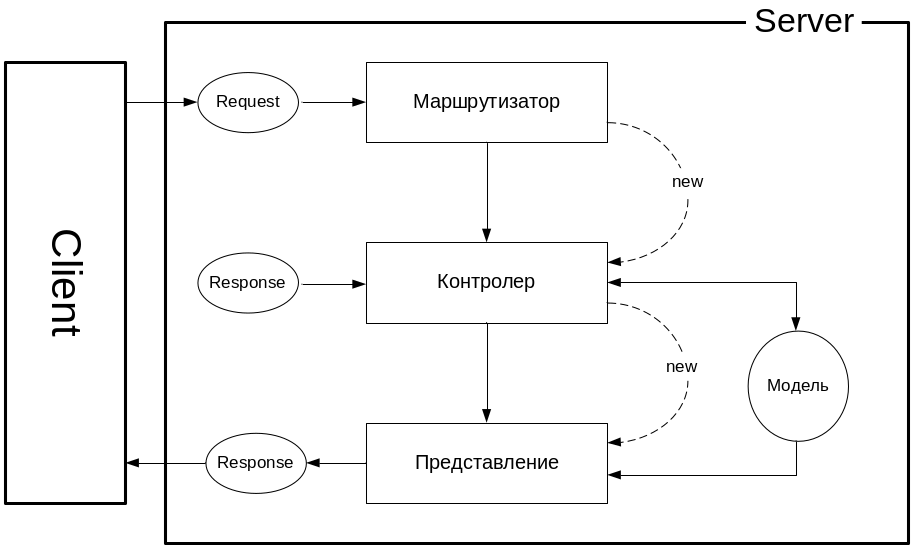

06.02.24  
**ОПРЕДЕЛЕНИЕ - Веб-приложение - 1. клиент-сервер, 2. клиент и сервер взаимодействуют по хттп**  
часто в качестве клиента выступает браузер  
.net core - платформа, главная особенность - кросплатформенность, открытость кода (на гитхабе лежит), модульность, нугет  
Asp.net core - платформа для разработки кроссплатформенных приложений, построена на платформе дотнет. не является кроссплатформенной в том смысле, что кроссплатформенность предоставляет дотнет, а она работает поверх него, так что она всё-таки кроссплатформенная  
Её ещё называют фреймворком ОС  
**платформа (важно) - прежде всего набор библиотек и инструментов для разработки приложений на этой платформе (компилятор, например)**  
Кроссплатформенность - бывает разная  
- на уровне исходного кода (надо перекомпилировать, например, библиотека qt для разработки гуёвых приложений, у неё есть заголовочные файлы и реализацию под каждую ось, потому что разные системные вызовы)  
- на уровне байт-кода (под каждую ось пишутся свои интерпретаторы и библиотеки (например, свои CLR))  

**CLR - просто интерпретатор IL, но навороченный (с JIT)** 
Дотнет кор - в основе это бибиотека Core FX и CLR  
Нугет позволяет устанавливать компоненты вашего приложения. Они оформляются в виде пакетов. Они устанавливаются в проекты из репозиториев  
Принцип pay-for-play - подтягивается (загружается в ОЗУ и исполняется только то, что используется)  
Увязать разные компоненты приложения получается только через зависимости  
- в зависимости входят CLR и JIT-компилятор
- зависимости перечислены в файле [AppName].deps.json, сборка происходит в рантайме

EXE-шник, получаемый при компиляции шарпов - это переименованный dotnet.exe, а функционал лежит в дллке  
Два типа развёртывания  
- Framework dependent deployment
- Self-contained deployment (весь фреймворк и библиотеки пакуются в ехешник)  

program files/dotnet (на линухе в етц)  
dotnet.exe - "пусковик", единая точка входа в любое дотнет приложение. потом уже подхватывает CLR. Также он называется мультиплексором (смелов не знает, почему). Сам фреймворк находится в dotnet/shared. Дотнет.ехе машинозависимый, входит в т.н. runtime-пакет  
по-другому дотнет.ехе называется хост-процессом (вообще хост-процесс - это процесс, запускающийся первым при запуске ОС)  
дотнет кор - это переименованный файл corehost.exe (или как-то так)  
любое запускаемое приложение запускается дотнетом.ехе  
мы всегда разрабатываем дллку, а затем запускаем через дотнет  
других способов запуска приложения на шарпах (и не только) кроме как через дотнет.ехе нет. можно даже просто запустить дотнет в program files и указать свою дллку и это будет работать  
в какой-то там библиотеке hostfxl.dll(?) находится машинозависимый код (на винде)  
конфигурационные файлы  
- runtime.config.json (фреймворки и их версии)
- файл с зависимостями

**асп дотнет кор - это платформа для разработки веб-приложений**  
есть разные типы приложений на асп, самый простой - обработчик запросов клиента  

OWIN  
дотнет кор вырос из дотнет кор фреймворк  
над фремворком работал асп, был переходный период, был разработан интерфейс Open Web Interface for .NET - это интерфейс, определяющий структуру любого асп дотнет кор приложения. **Определяет правила взаимоотношений 4 компонентов серверной части любого асп дотнет кор приложения**: *хоста* (любое дотнет приложение, создающее процесс и управляющее жизненным циклом сервера), *хттп-сервера* (у нас kestrel) (программа, умеющая принимать битовые последовательности от клиента и превращать их в объекты запроса и умеющая принимать объекты типа ответ и отправлять их клиенту), реализующего OWIN, *мидлваре* (конвейер обработки запроса и ответа, последовательность модулей, обрабатывает запрос, затем обрабатывает ответ), *приложение* (обработчик запросов) - **важная схема**  
запрос попадает на конвейер, делает крюк через обработчик и отправляется ответом клиенту (или как-то так)  
хосты и серверы есть готовые, мы будем разрабатывать обработчики запросов  

13.02.24  
OWIN: изначально существовал класс Startup, инициализировавший приложение. Теперь всё это затолкали в Program.cs. Несмотря на это, структура прилоджения не изменилась  
Юзер агент в OWIN не входит  
Разделение на 4 компонента нужно для стандартизации и чтобы кто угодно мог разработать свой компонент  
Проект катана от микромягких демонстрирует разнообразие компонентов (старый, разбирать не будем, но на всякий случай)  
Фреймворки встраиваются либо в application, либо в middleware  
Часто фреймворк поставляется в виде middleware  
Простейшее приложение - обработчик HTTP-запросов  
- применяется паттерн builder
- колбэки
- конфигурация описана в нескольких файлах
    - appsettings.json
    - launchSettings.json (указывает способы запуска, нужен только при отладке)
        - порт
        - окружение (поддерживается 3), можно добавлять в код проверки на окружение, чтобы выполнять определённый код только для определённой стадии разработки
            - development
            - stage (то, что отдаётся на тестирование)
            - product

Когда браузер получает строку запроса, выполняется разрешение имени (gethostbyname, описана в posix, посылает запрос (send) с отфоматированным запросом (метод, версия, ...))  
Каждый вышестоящий протокол - формат передачи данных для нижних протоколов (ip - для ethernet, tcp - ip, http - tcp, ...)  
listener принимает sockaddr_in и создаёт очередь подключений, accept выбирает подключения из очереди и создаёт сокет клиента - всё это делает сервер. Затем при помощи receive получает данные, парсит их, строит объект request и записывает в него данные из запроса, строит объект response, половину заполняет, остальное должен заполнить обработчик, и только затем ищет обработчик по методу и URI. Так устроены все веб-приложения  
Статические ресурсы - ресурс, который как на сервере лежал, так на клиент и отправился (скрипты, стили, картинки, ...)  
Middleware определяет, когда запрос делается для получения статического ресурса и отправляет его  
Создаётся папка wwwroot (имя захардкожено). app.UseStaticFiles() - указание middleware обрабатывать запросы к статическим файлам. Всё, что булет кончаться на расширение (.jpeg, .html, ...) будет интерпретироваться как статический ресурс и искаться в папке wwwroot  

WebSocket - протокол. Позволяет устроить дуплексный канал над TCP (тоже дуплексный, что очевидно). Дуплекс - два однонаправленных независимых канала, один в одну сторону, другой в другую. WebSocket - тоже веб-приложение (?). Соединение по этому протоколу устанавливается по HTTP. Делается следующим образом: клиент отправляет запрос на ws://... или wss://... и заголовком Connection: Upgrade (меняем протокол) и получает ответ с Upgrade: websocket (меняем на вебсокет). Код ответа в случае успеха - 101 (смена протокола)  
app.UseWebSockets() - тоже мидлваре будет перехватывать все запросы с Connection: Upgrade и будет отвечать ответом 101  
Получение и отправка сообщение независимы друг от друга, могут выполняться в разных потоках, ибо дуплексный канал  

20.02.24  
Как правило http-сервер и хост постоянно находятся в памяти (резидентные), обработчик обычно создаётся для обработки одного запроса и уничтожается, не хранит состояние (если объявить переменную и присвоить ей что-нибудь, при следующем запросе значение не сохранится)  
В простейшем приложении хост - функция Main, обработчик (нерезидентный) - это app.MapMethod  
DefaultFiles - статические ресурсы, которые пойдут клиенту по умолчанию. Обычно настроены на корень. Подключается также при помощи Use..., значит это мидлваре (на конвейере, при этом должен находиться до UseStaticFiles). Позволяет создать любой ресурс с именами index/default.html/htm. Если нет обработчика на корень, то используется файл по умолчанию. Когда ставится UseStaticFiles, автоматом создаётся обработчик на статические файлы и ничего более. Тот же обработчик, но встроенный в конвейер (наши обработчики тоже на конвейере, но в конце)  
Чтобы не путать, какие файлы сначала обрабатывать, есть UseFileServer(просто заменяет UseDefaultFiles(); UseStaticFiles();)  
Вроде, если на странице есть link, src,... то браузер или сервер автоматом ставить connection keep-alive  
Список файлов по умолчанию можно расширить DefaultFilesOptions.DefaultFileNames.Add("new-name.xd"); app.UseDefaultFiles(options)  
UseDirectoryBrowser позволяет настроить директорию для раздачи файлов с сервера. Принимает DirectoryBrowserOptions с FIleProvider и Path (вроде)  

## MVC
  
  - сервер - это HTTP-сервер
  - объект запроса утрированно поступает в маршрутизатор (компонент, распаршивающий URI), который на основе запроса выбирает контроллер и вызывает его, передаёт ему в качестве параметров объекты запроса и ответа
  - маршрутизатор работает как мидлваре (встречает запрос, разбирает URI и при помощи специальной таблицы маршрутизации определяет имя контроллера и действия)
  - контроллер обрабатывает объекты запроса и ответа, если ему недостаточно, то "ходит в модель", в итоге создаёт представление
  - *где-то там используется фабрика, создающая контроллеры (контроллер - это класс)*
  - action вызывает специальный компонент фреймворка MVC: RazorEngine
    - RazorEngine создаёт объект представления один раз (при следующем аналогичном запросе используется ранее созданный объект), в качестве параметра принимает имя файла с .cshtml и создаёт объект C# (его методы, в том числе execute, заполняют объект ответа)
      - вызывает метод с типом IActionResult контроллера
  - для модели обычно используется **Entity Framework (реализация ORM (Object Relation Mapping (методология построения фреймворка/интерфейса с БД, предполагает, что объектам базы данных ставятся в соответствие программные объекты)))** ВАЖНО
    - **таблице соответствует DBSet**
    - **базе данных - ContextDB, в котором прописаны DBSetы**
    - **структуре таблицы - модель, класс, в котором прописаны свойства, каждое из которых соответствует столбцу**
    - **строке таблицы - элемент коллекции DBSet**
    - **репозиторий - слой ПО, надстраивающийся над API Entity Framework**, *где-то там есть возможность подменить ДЛЛ, чтобы без потерь работать с уже другой ДЛЛ*
  - представление не стоит "пускать в модель" (это неправильно по методологии, потому что независимость компонент должна быть максимальной)

Маршрутизатор может быть сделан в рамках мидлваре  
Паттерн нужен для разграничения логики, упрощения расширения  
Главное требование MVC - все компоненты должны быть максимально независимы друг от друга  

Компоненты
  - маршрутизатор (принимает запрос, парсит URI, определяет контроллер, создаёт его объект, вызывает соответствующий метод, передаёт ему нужные параметры, метод обычно возвращает View, ...)
  - модель (ответственная за данные)
  - представление (за вывод, отображение данных)
  - контроллер (за обработку запроса)

27.02.2024
Два типа приложений на аспдотнеткор:
  - MVC
  - WebAPI

На схеме веб-приложения "Ресурс - программный код" - это MVC-приложение  
UseMvc() - та часть мидлваре, которая разбирает URI, определяет контроллер и действие  
Фабрика контроллеров работает на основе **рефлексии** (должна посмотреть, есть ли такой контроллер, в сборке)  
Признаки контроллеров
  - наследуется от Controller либо *слово Controller в названии класса*
  - неабстрактный публичный класс
  - не generic
  - не уложен в другие типы
  - не декорирован [NonController]

Проект выглядит следующим образом:
  - папка controllers
  - папка views (с .cshtml-файлами)

Если явно не указывается имя контроллера и действия, то имя контроллера текущее, а имя .cshtml-файла совпадает действия. Например: в классе HomeController метод Index(), возвращающий View(), тогда контроллер - Home, а представление - Index.cshtml  
.cshtml может содержать всё то же, что .html, плюс разметку для RazorEngine (для того, чтобы на её основе он мог создать класс)
  - Layout - имя публичной переменной, нходящейся в базовом классе (RazorPage) класса, который будет создаваться из этого .cshtml

Параметры, передающиеся в действие, могут иметь три источника:
  - строка запроса
  - query parameters
  - в теле запроса, но в разных видах (определяется заголовком Enctype)

05.03.2024  
Razor - это и движок, и имя разметки  
dynamic - тип с динамическими свойствами, заранее тип неизвестен, выполняется на лету, можно приводить к нужным типам  
Коллекции аспнеткор:
  - viewbag (динамический объект (dynamic), позволяющий сохранять данные в рамках одного запроса)

Маршрутизация может быть как явной через маршрутизатор, так и неявной при помощи аннотации Route  
Любой C# объект описывается при помощи метаданных, находящихся в сборке. При использовании аннотации записывается свойство в метаданные (нам это свойство просто через объект класса не доступно)  
Машруты при помощи аннотаций записываются в таблицу машрутизации  

**Controller**  
**Dependency Injection** - вытаскивание алгоритмов, исполняемых в рамках какого-либо объекта, за пределы этого объекта (**механизм, позволяющий создавать в автоматическом режиме объект некоторого класса или реализующие некоторый интерфейс и задавать их ЖЦ** (когда появляется, когда умирает))  
...Base отличается от Controller тем, что первый наследуется от второго и не умеет делать View  
Требования к действию:
  - нестатический публичный метод контроллера
  - не дженерик
  - не помечен [NonAction]
  - можно перегружать, но обязательно используя аннотации ([Action], [ActionName], ...)
  - ref-, out-параметры запрещены
  - возвращает IActionResult

12.03.2024  
В аспдотнеткор есть возможность подменить фабрику, создающую контроллеры  
Сначала работает фабрика контроллеров, затем работает инвокер (то ли класс, то ли метод) (его тоже можно подменить), который вызывает нужное действие и передаёт ему параметры  
Действия могут быть перегружены, но в таком случае они должны быть разнесены по разным HTTP методам  
Действие может возвращать
  - представление
  - статус (функции BadRequest, NotFound, ...)
  - файл (File(stream, MIME, name))

**Поток данных** - абстракция над данными, позволяющая представить данные на каком-то носителе в виде непрерывного набора байт, которые можно считывать  

## Dependency Injection  
... - специальный механизм, с помощью которого можно описать такие классы, объекты которых будут создаваться в автоматическом режиме на базе какой-то библиотеки/платформы, и можно определить ЖЦ этого объекты (когда рождается, когда умирает)  
ЖЦ
  - transient
  - singleton

Является частью IOC (Inversion of Control) (всё, что выполняется и имеет алгоритмическую основу, надо выносиь в отдельный класс и передавать в нужный класс, например, через конструктор)  
