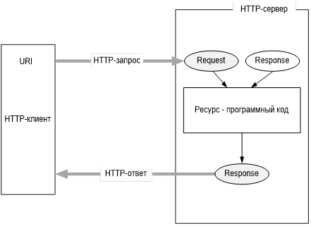
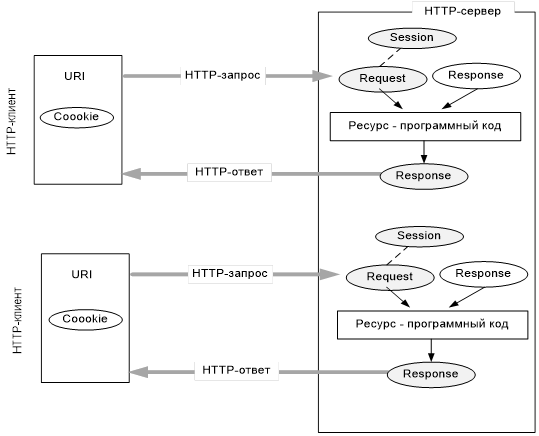
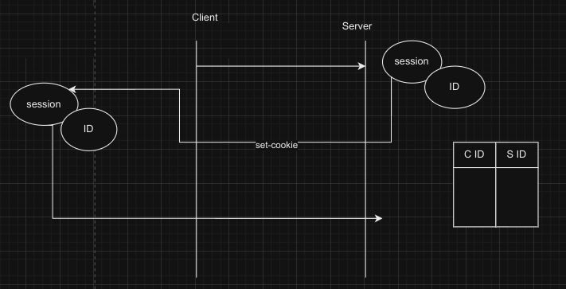

07.02.24
Основные принципы зацементированы протоколом хттп
Хттп определяет архитектуру веб-приложений
ОПРЕДЕЛЕНИЕ (опять самодурит) **Интернет - 4 компоненты**
  - стек тцп/ип (в первую очередь интернет - это сеть, в которой используется стек тцп/ип)
    - Все разработчики когда-то договорились, что стек тцп/ип будет включаться в их операционные системы
  - службы интернет (днс, мыло, фтп, телнет, www, ...) - сервер + протокол доступа к этому серверу (важная особенность - порт, ею прослушиваемый (первые ~1024 портов зарезервированы для служб интернета))
    - не надо путать хост интернета с хост-процессом или приложением из разработки серверов
    - разработка веб-приложения - это разработка службы интернет (www)
  - набор организций, обеспечивающих работу интернета (головная - ISOC (Internet Society), занимается развитием сети, остальные так или иначе ассоциированы с ней)
    - IETF (Internet Engineering Task Force) - инженерная группа, проектирующая интернет. Выпускает документацию всего, что работает в интернете (RFC (Request for comments). Если помечен как STD, то он больш не будет меняться). Её деятельность тоже описана в RFC 4677
    - IAB (Internet Architecture Board) - совет по архитектуре интернета, одна из комиссий IETF
    - ICANN (Internet Corporation for Assigned Names and Numbers) - управляет доменными именами и айпишниками. Торгуют доменными именами. Она поддерживает сервера, отвечающие за корневые доменные имена
    - IANA (Internet Assigned Numbers Authority) - поддерживают и регистрируют типы данных, принятых в интернете (MIME (Multipurpose Inernet Mail Extensions)). Любой контент в интернете идентифицируется в MIME (заголовоки типа Accept-Type)
    - W3C (WWW Consortium) - разрабатывает и отдаёт в IETF для стандартизации (хттп, хтмл, цсс, юрл, пнг)
  - Документация (RFC)
**ЗНАТЬ КАК СВОЮ БИОГРАФИЮ ^^^**
Консорциум - это некоммерческая организация, существующая для согласования стандартов, общественной деятельности. Юникод - тоже консорциум
**Интернет-ресурс - всё что имеет адрес в интернете (служба тоже ресурс)**
**Программирование в интернет - разработка распределённого приложения, предоставляющего >=1 связанных между собой ресурсов**. Частные случаи: сайт, облако
Технологии программирования в интернет (все кроссплатформенные)
  - LAMP (linux, apache, mysql, php/perl) древняя, но до сих пор работает
  - Java EE
    - application server - сервера, описанные в документации Java EE (tomcat, glassfish, ...)
  - ASP.NET
  - Node.JS
  - Ruby on Rails
  - Django
Для связи между компонентами как правило используются протоколы WebSocket, WebDav, SMTP, POP3, IMAP

## Основы веб-программирования
%определение веб-приложения%
Могут быть разные формы взаимодействия между клиентом и сервером
  - один клиент, один сервер
  - один клиент, несколько серверов
  - несколько клиентов, один сервер
  - несколько клиентов, сервер общается с другим сервером (первый сервер - клиент по отношению ко второму)
TCP, WebSocket - дуплексные (можно рассматривать как два противонаправленных симплексных канала)
**Свойства ХТТП ТОЖЕ ЗНАТЬ КАК БИОГРАФИЮ**
  - асимметричный (сообщения от клиента к серверу и наоборот отличаются: запросы и ответы)
  - полудуплексный канал (в каждый момент времени сообщение может передвигаться либо в одну сторону, либо в другую)
  - версии
    - 1.1
      - действующий
      - текстовый
    - 2
      - черновой
      - бинарный
  - два типа абонентов
    - клиент
    - сервер
  - на один запрос - один ответ, иначе ошибка и наоборот
  - TCP-порты 80, 443
  - для адресации URI/URN
  - поддерживается W3C, описан в нескольких RFC
**Запрос ТОЖЕ ЗНАТЬ**
  - метод
    - options
    - get
    - put
    - post
    - head
    - delete
    - trace
    - connect
    - какой-то неизвестный extension-method
  - URI
  - версия
  - заголовки (пары имя: значение) нужны для управления соединением
    - описанные в протоколе ХТТП (**ЗНАТЬ ПО ДВА ЗАГОЛОВКА КАЖДОГО ТИПА**)
      - general (в запросах и ответах)
        - Cache-Control
        - Pragma
        - ...
      - request
        - Accept
        - Accept-Charset/Encoding/Language
        - Range (какие части ресурса должен вернуть сервер)
        - ...
      - response
        - Age (сколько объект пробыл в прокси-кэше)
        - Retry-After (сколько клиент должен ждать перед повторным запросом)
        - ...
      - Entity для сущности в запросах и ответах
        - Contrnt-Type/Range/MD5/...
        - ...
    - кастомные заголовки
  - параметры (пары имя: значение) могут передаваться несколькими способами
    - если гет, передаётся как часть URI
    - если форма, то в теле запроса
  - расширение/тело (одно и то же) (в гет его нет совсем)
**Ответ (угадай, что с ним надо сделать)**
  - версия
  - код
  - пояснение к коду
  - заголовки
  - тело
Параметров в нём нет
**Коды состояния**
  - 1xx - информационные
  - 2xx - успешные
  - 3xx - редирект
  - 4xx - ошибка клиента
  - 5xx - ошибка сервера

14.02.24
Вроде как от URL отказались, теперь это называется URI (Смелов не помнит источник, но раз надо, значит, надо)
URL описывает множество URI, содержит местонахождение ресурса и протокол
Протокол STD66 (устоявшийся RFC, железобетонный) описывает URI
**Веб-браузер - один из видов HTTP-клиентов**. Превратились в операционные системы. Характеризуется
  - DOM
  - BOM (API с **localStorage, sessionStorage, history, window, navigator, ...** - объекты, свойственные браузеру. Отдельно стоит объект XmlHttpRequest, позволяющий выполнять асинхронные запросы)
  - CSS
  - JS (Какой стандарт EcmaScript поддерживает)
  - HTML5 и его API (canvas, work, media, geolocation, filesystem, ...)
  - поддерживаемые протоколы HTTP
!!**DOM -  модель представления браузером HTML-страницы + API**. Браузер парсит страницу в объекты и предоставляет API для доступ а к этой древовидной структуре (не только для жабаскрипта, но я для прочих языков. document - объект браузера, а не языка). Представлен на сайте W3C  
Когда браузер обрабатывает страницу, он добавляет сначала скрипт объявления таких объектов, как document  
У браузеров есть движки
  - js
  - html
  - ...
Веб-серверы: IIS, Apache, Glassfish, Tomcat, nginx

## Общие принципы разработки веб-приложений
Самая простая схема веб-приложения:

При поступлении запроса мидлваре создаёт объекты запроса и ответа
Обычно ресурс создаётся для обработки запроса и уничтожается. Для каждого клиента в таком случае создаётся свой ресурс. Это делается потому, что предполагается, что таких запросов может быть очень много, и если их не уничтожать, то система быстро ляжет. Такая система не хранит состояния.
Проверить то, что HTTP не хранит состояния, можн оследующим образом: установить запросом переменную программного объекта и посмотреть вторым запросом, установилась ли она. Если не установилась, то для каждого запроса создаётся новый программный объект
Есть RFC, регламентирующий сохранение состояния на строне сервера
На сеансовом уровне OSI происходит шифрование, на этом уровне необходимо сохранение состояния
Объект сессии описывает соединение на сеансовом уровне
TCP должен помнить своё состояние, чтобы гарантировать правильную очерёдность доставки пакетов (у каждого пакета свой номер) (в отличие от UDP)
В веб-приложениях для хранения состояния используется специальный **программный объект** (у которого есть id - обычно 128bit число - и **который соответствует серии запросов**). У любой сессии есть начало и конец (первый и последний запрос). Они определяются следующим образом:
  - есть параметр session timeout (определяет максимальный интервал между запросами в рамках одной сессии. При превышении этого интервала сессия разрушается, и при следующем запросе начинается новая (обычно 20-30 минут))
  - для определения начала серии запросов используется специальный механизм HTTP - куки (сервер смотрит на запрос: если есть куки с session id, то не первый, иначе первый )
    - куки - фрагмент данных "ключ - значение", который может быть запомнен на стороне клиента по указанию сервера (заголовок Set-Cookie). Есть параметр path: шаблон URI: браузер запоминает куки по этому наблону. Если path не указан, то вместо него используется uri, с которго был получен ответ с заголовком Set-Cookie. После установки куки каждый запрос на заданный URI обязан содержать заголовок Cookie с установленными куками (в которых может содержаться session id)  

Сессия:  
  
Обычно сервер в свойства ответа записывает идентификатор сессии или делает ссылку на объект сессии  
Сессия - одно из хранилищ, в котором можно сохранять данные (в запрос писать данные тоже можно, но они сохраняются всего на один запрос)  
Кончилась ли сессия, определяется по Session Timeout, время скользящее, при каждом запросе продлевается  
Куки - метод сохранения состояния на стороне клиента  

21.02.2024  
Два объекта веб-приложения:
- запрос
- ответ
Обычно у сессии есть хранилище  
В REST API рекомендуется хранение состояния на стороне клиента, потому что при балансировке нагрузки на разные сервера данные клиента на сервере могут не сохраниться  
Контекст приложения - резидентный объект - предназначен для хранения информации о веб-приложениb (в том числе сервере), хранится в конфигах  
Резидентные объекты создаются при старте сервера  
Хранилище может быть реализовано по-разному, но обычно - это объект process (в nodejs)  
Программистам доступно 3 хранилища:
- request (самое маленькое и недолгоиграющеее)
- session (для хранения информации между запросами)
- контекст (между сессиями)
Есть механизмы, позволяющие записывать данные в конфиги, чтобы при старте сервер получал пользовательскую информацию  
**Персистентность** - способность сохранять состояние (условно говоря, на другом носителе). Обычно это контекст, но в некоторых системах ещё и сессии  
Фильтр/мидлваре - конвейер обработки запроса и ответа. Любой из элементов конвейера может самостоятельно ответить на запрос и не пустить его дальше  
Фильтр - объект, реализующий некий интерфейс  
Сначала создаётся приложение, в которое затем дописываются цепочки фильтров  
В некоторых системах может быть несколько цепочек фильтров (например, по одной на каждый URI)  
Listeners - специальные серверные объекты, предназначенные для обработки событий на стороне сервера (запуск и остановка сервера и т.д.)  
Можно создать резидентный объект при помощи обработчика на старт сервера, передавая ссылку на объект всем обработчикам запросов, и пока сервер будет работать, этот объект будет жить в памяти  

*Кеш (се(р)верный)*  
Кеширование - перемещение данных из медленной памяти в быструю  
Кешировать будем ответы  
Есть кеш-менеджер
- приходит запрос, он его обрабатывает
- запрос обрабатывается обработчиком
- на обратном пути по конвейеру кеш-менеджер запоминает ответ в кеше (в простейшем случае - по URI)
В некоторых кешах поддерживается не только абсолютное время, но и скользящее (время между запросами)  
В нормальных системах ключи составные, могут содержать все параметры строки запроса и т.д.  

06.03.2024  
Преимущество соединения перед отсутствием сессии при помощи Connection: Keep-alive - можно разом запускать несколько запросов в рамках одной сессии параллельно, не дожидаясь ответа на предыдущий (pipelining/конвейер, устарело)  
Пул соединений - специальный объект, предназначенный для соединения с БД. Обычно имеет два ключевых параметра: минимальное и максимальное количество соединений. Чтобы он не выгрузился из памяти, можно поместить его в контекст при запуске сервера  
При превышении максимального количества соединений образуется очередь  
WebAPI/сервисы - приложения, работающие для других приложений  
Сервисам запрещено кешировать на стороне сервера, т.к. можно поднимать несколько экземпляров микросервиса, и кеш может быть не у того сервиса, к которому обращается клиент, ответ для которого был кеширован  
Разрешается кешировать и сохранять состояние на стороне клиента (куки и uri (которые длиннющие с кучей параметров))  
Кешированием управляет сервер и он заинтересован, чтобы к нему было поменьше запросов  
Для определения, нужно ли отправлять файл заново или можно брать из кеша, используются заголовки Last-modified и If-Modified-Since с датами  
ETag содержит хеш отправляемого файла, If-None-Math содержит хеш файла в кеше (если хеш отличается, отправляется файл, иначе - 304)  

**AJAX**  
... - **методология** (принципы и правила написания кода) разработки, которая основывается на возможности объекта XMLHttpRequest выдавать асинхронные запросы (не написание кода, при котором страница не перезагружается, это следствие)  

## HTTP-Аутентификация  
Идентификация - заявление пользователя о себе  
Аутентификация - процедура проверки подлинности идентификации пользователя  
  - BASIC (логин и пароль, все запросы, которые шлёт клиент, должны идти с заголовками Authorization)
  - DIGEST (похожа по сути, отличается передачей набора параметров, которыми клиент будет хешировать)
  - FORMS (логин и пароль отправляются с разделителем из двух амперсандов. Сервер возвращает битовую последовательность - токен)
Авторизация - процедура проверки прав аутентифицированного пользователя  
REALM - область действия данной аутентификации  

13.03.2024  
HTTPS - расширение HTTP. Добавляет 2 возможности: **аутентифицироваться** и **шифровать канал**. Надстройка над TCP, добавляет сокетам безопасность  
TLS (суть новая версия SSL) находится между TCP и HTTP. Использует сокеты для соединения  
В процедуре аутентификации используется электронный документ: сертификат - удостоверяющий сервер. Он содержит имя держателя, адрес, серийный номер сертификата, даты проверки, активный ключ держателя и кучу всего ещё  

20.03.2024  
На стороне клиента и сервера должны быть установлены сертификаты центра сертификации (в осях есть свои хранилища сертификатов)  
TLS выполняет аутентификацию и шифрование канала  
Сеанс - последоватьельность запросов и ответов, разница во времени между которыми не превышает session timeout  
**TLS-рукопожатие** (клиент должен убедиться, что сервер - тот, за кого себя выдаёт; должны договориться о сеансовом ключе симметричного шифрования (когда один ключ и для за-, и для расшифрования))
1. Клиент отправляет серверу Hello-сообщение (список шифронаборов (шифронабор - пронумерованная совокупность, в которой описывается, как вырабатывается сеансовый ключ, какой метод шифрования, хеширования, сжатия, ...; есть стандартные шифронаборы), браузер отправляет список всех поддерживаемых шифронаборов)
2. Сервер отправляет Hello-сообщение (сертификат сервера)
3. Клиент проверяет сертификат. Если всё в порядке, берёт из сертификата публичный ключ, создаёт сеансовый ключ, шифрует его публичным ключом сервера и отправляет его серверу
4. Сервер расшировывает сеансовый ключ своим приватным ключом и дальше шлёт пакеты, зашифрованные сеансовым ключом

Запись TLS - тип (1 байт), версия протокола (2), длина данных (2), данные (0...18432)  
Типы: change cipher, alert, handshake, application data  

## Токен-аутентификация (single sign-on)
Суть - пусть есть распределённая система с множеством компьютеров. На каждом стоит какая-то своя сущность (БД, сервер, сайт, ...). Есть компьютер, который называется identity-узел и выдаёт токены (битовые последовательности, которые позволяют проверить клиента с данной последовательностью на действительность токена). Есть процедура обновления/продления токена (зависит от протокола)  
Есть контроллер домена - компьютер, на котором хранится информация (*для входа?*)  
Клиент - программа, работающая в распределённой системе. Сервис-провайдер - тот, кто выдаёт полезную информацию (он сам зарегистрировался у identity-провайдера и получил от него какой-то секрет, при помощи которого он может проверять токены)  

Пассивный клиент - браузер. Регистрируется у identity-сервера, стучится на сервис-провайдер точо так же. При регистрации identity-сервер указывает, куда нужно перенаправить зарегистрированного клиента с токеном, потому что клиент этого не знает  
Токены бывают разные: (как минимум, access и refresh (он этого не говорил))  

**OAuth2** - добавляются resource server, authorization server и т.д.  

27.03.2024
на стороне сервера айди сессии свой, на стороне клиента - свой, у сервера есть таблица соответсвтия серверного айди клиентскому. Обновляется не клиентский айди, а запись в серверной таблице, что позволяет сэкономить на заголовке set-cookie  
  
## HTTP 2
Все браузеры поерживают HTTPS только 2 версии  
**Бинарный формат** - информация изначально находится в закодированном сжатом виде, т.е. информацию просто так глазами не прочитаешь  
Сообщения отправляются кадрами (frame). Они ходят между клиентом и сервером  
Типы  
  - data
  - headers
  - priority
  - ...
Кадр: 24 бита длина, 8 - тип, 8 - флаги, 31 - идентификатор потока данных, полезная нагрузка - 0...  
Поток: внутри одного осединения может быть несколько потоков. Если разница между соединением и логическими каналами  
Данные кадра: 8 - pad length, * - данные, * - смещение  
В ХТТП2 предусмотрена приоретизация, и можно указать вес, в соответствии с которым отправляются данные  
Псевдозаголовки: (в хттп1 формат позиционный (у каждой части запроса/ответа есть позиция, они разделяются символами-разделителями). В хттп2 не так) в начале у них двоеточие
  - :imethod (в его рамках передаётся метод)
  - :scheme (содержит часть uri, отвечающую за схему)
  - :authority
Мультиплексирование - способность браузера поддерживать несколько ТЦП-соединений одновременно  
В ХТТП2 есть возможность создавать push-serverы - упреждающее кеширование. Вместе с ответом можно отправить данные, которые клиент по протоколу будет обязан закешировать  

## HTTP3
Синтаксически ничем не отличается от 2 версии  
В качестве транспорта используется UDP  
Для упорядочивания и обеспечения доставки пакетов используется протокол QUIC, являющийся прослойкой между HTTP3 и UDP  
Сокрщена процедура рукопожатия (как?)  

## WebDAV (Distributing Authoring and Versioning)
